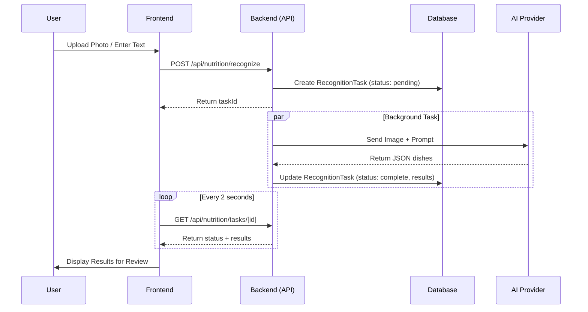

# System Flows

This document details the core logic and integration flows of YuHeng, explaining how different components interact to process user requests.

## Meal Recognition Lifecycle

YuHeng uses an asynchronous flow to ensure the UI remains responsive even during complex AI analysis.

## Smart Portion Scaling Logic

When a user adjusts their personal portion or shares a meal, the following calculation occurs:

1. **AI Input**: AI estimates the *total* nutrition for the dish in the photo (e.g., 500 kcal).
2. **User Input**: User specifies their portion (e.g., 50% or "shared by 2 people").
3. **Calculation**: `LoggedCalories = TotalCalories * (PersonalPortion / TotalDish)`.
4. **Storage**: The scaled values are written to the database, while the original AI estimate is optionally kept as metadata.

## Regional Adaption Flow

When a user changes their region in settings:

- **State Sync**: The `SettingsPage` updates the local state and triggers `saveSettings`.
- **Unit Conversion**: If switching between `g` and `oz`, the app attempts to convert current target values to keep them consistent for the user.
- **Provider Context**: Subsequent AI requests include the new `recognition_language` and `region` context to improve localized accuracy.
