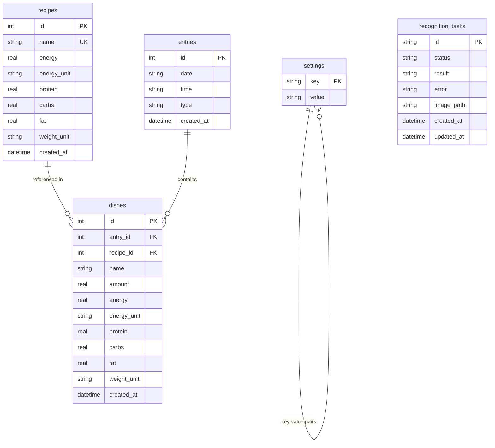

# Database Design

YuHeng uses SQLite for its simplicity and reliability in local environments.

## Schema Overview

## Tables Description

### `recipes`
Stores the default nutritional information for specific food items (per 100 units).

### `entries`
Represents a meal event. It groups multiple dishes together at a specific date and time. `type` classifies the meal (Breakfast, Lunch, etc.).

### `dishes`
The individual components of a meal.
-   **Snapshotting**: To maintain data integrity over time, nutritional values (energy, protein, etc.) are copied from the `recipes` table into the `dishes` table at the time of entry.

### `settings`
A simple key-value store for user configurations:
-   `meal_times`: JSON object defining meal time windows.
-   `daily_targets`: JSON object for energy and macro goals.
-   `unit_preferences`: User choice for energy (kcal/kj) and weight (g/oz).

### `recognition_tasks`
Tracks the status of AI-powered image analysis tasks, allowing for asynchronous processing and error handling.
