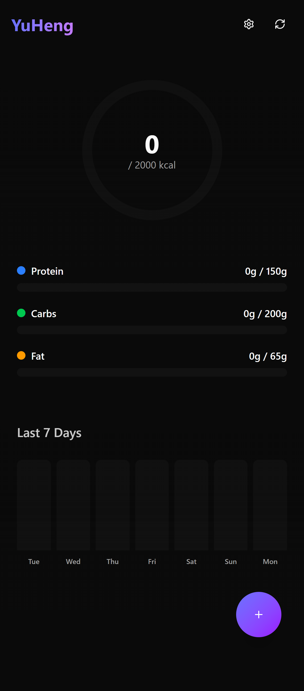
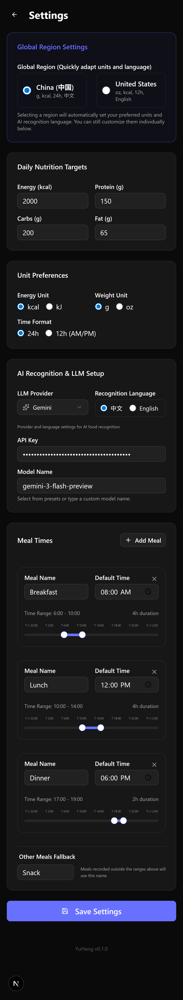

# yuheng

YuHeng(玉衡 Jade Balance) - A local nutrition tracking app named after the fifth and brightest star in the Big Dipper constellation in traditional Chinese astronomy. Just as this star serves as a guiding and balancing force, YuHeng aims to help users in tracking their nutrition effectively.

## Features
- 📸 Photo-based food logging
- 🤖 Auto-recognition of dishes using Gemini/OpenAI/Compatible LLMs
- 📊 Daily nutrition stats & weekly history
- 🍽️ Support for backfilling meals (Breakfast, Lunch, Dinner, Snack)
- 🐳 Docker support with persistent DB (SQLite & PostgreSQL)
- ⚡ Asynchronous image recognition queue
- ⚖️ Unit conversion (kcal/kJ, g/oz)
- ⏰ Custom meal times configuration
- 👥 Meal sharing & portion splitting
- 🔍 Packaged food scanning & recognition

## Supported LLM Providers

YuHeng supports a wide range of LLM providers for food recognition:
- **Google Gemini**: Optimized for vision tasks (Gemini 2.5 Flash, Gemini 3 Flash/Pro).
- **OpenAI**: GPT-4o and GPT-4o mini.
- **OpenAI Compatible**: Support for various providers like DeepSeek, Qwen-VL, GLM-4V, Doubao, etc.

Detailed model lists can be configured in the settings page.

## Getting Started

1. Clone the repo
2. Run `npm install`
3. Run `npm run dev`
4. Open `http://localhost:3000`
5. Configure your LLM Provider and API Key in the settings page.

## Docker Usage

Build the image:
```bash
docker build -t yuheng .
```

Run the container:
```bash
# Create a data directory
mkdir data

# Run container
docker run -d \
  --name yuheng \
  -p 3000:3000 \
  -v "$(pwd)/data:/app/data" \
  ghcr.io/formaxcn/yuheng
```

When you mount an empty `data` directory, the container will automatically initialize the database with default settings. If you mount a directory that already contains a `nutrition.db` file, the database will remain untouched.

## Environment Variables

| Variable | Description | Required | Default |
|----------|-------------|----------|---------|
| `POSTGRES_URL` | PostgreSQL connection string (if using Postgres) | No | SQLite |
| `DB_PATH` | Path to SQLite database file | No | `./nutrition.db` |

The app will automatically use PostgreSQL if `POSTGRES_URL` is provided. Otherwise, it defaults to SQLite.

## Docker Usage

### Docker Run (SQLite)

```bash
# Create a data directory for SQLite
mkdir data

# Run container
docker run -d \
  --name yuheng \
  -p 3000:3000 \
  -v "$(pwd)/data:/app/data" \
  ghcr.io/formaxcn/yuheng
```

### Docker Compose (PostgreSQL)

You can easily start YuHeng with a PostgreSQL database using Docker Compose:

1. Run:
```bash
docker-compose up -d
```
This will start both the YuHeng app and a PostgreSQL database.

## API Documentation

API documentation is available at `/api/docs` (JSON) or `/api/openapi.json`. 
You can import this into Postman or explore via Swagger UI.

## Project Documentation

Detailed technical and user-facing documentation for YuHeng:

### ✨ Features
User-centric guides on what YuHeng can do and how it works.

- [**Smart Food Logging**](features/smart_logging.md): AI-powered dish and text recognition.
- [**Packaged Food (OCR)**](features/packaged_food.md): Specialized recognition for nutrition labels.
- [**Portion Management**](features/portion_sharing.md): Sharing meals and smart weight scaling.
- [**Dashboard & History**](features/dashboard_history.md): Tracking daily progress and weekly trends.
- [**Backfilling Logic**](features/backfilling.md): Manual entries and automatic classification.
- [**Recipe Library**](features/meal_library.md): Recipe re-entry and automatic snapshotting.
- [**Regional Adaption**](features/regional_adaption.md): One-click setup for CN/US regions.
- [**Unit Preferences**](features/unit_preferences.md): Switching between kcal/kJ and g/oz.
- [**Backend Status**](features/backend_status.md): Real-time health monitoring and version display.

### 🛠️ System Design
Technical details for developers and contributors.

- [**Architecture Overview**](design/architecture.md): High-level tech stack and project structure.
- [**System Flows**](design/flows.md): Core logic and integration sequence diagrams.
- [**Database Implementation**](design/database_adapter.md): Adapter pattern for SQLite and PostgreSQL.
- [**Database Schema**](design/schema.md): Detailed table definitions and snapshotted relations.
- [**Prompt Engine**](design/prompt_engine.md): Decoupled management of AI instructions.
- [**LLM Integration**](design/llm_integration.md): Multi-provider support and factory logic.
- [**Docker & Deployment**](design/deployment.md): Standalone builds and container orchestration.
- [**Page Implementation**](page_implementations.md): Breakdown of the frontend application.

## Configuration

Settings like meal times, daily targets, and API keys can be configured directly in the app's settings page.

## Roadmap

- [ ] Support for multiple users
- [x] Migrate database to Postgres (Stable)
- [x] Packaged food scanning & recognition
- [x] Multi-provider LLM support (Gemini, OpenAI, Compatible)
- [ ] Mobile app version
 
 ## Screenshots
 
 <p align="center">
   
   
   
 </p>
